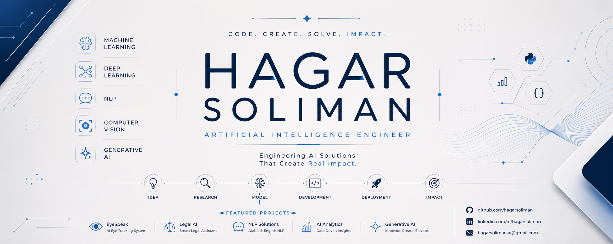

  

# Hi, I'm Hagar Soliman 👋

Artificial Intelligence Engineer specializing in Machine Learning, Deep Learning, Computer Vision, and Generative AI.

I enjoy building AI applications that solve practical problems, from computer vision systems to predictive models and NLP applications. Most of my work is done with Python, and I like turning research ideas into usable software.

## Technologies

- Python
- TensorFlow
- PyTorch
- OpenCV
- Scikit-learn
- FastAPI
- Flask
- SQL
- Streamlit
- Git
- Generative AI
- RAG
- LLMs
- Pandas
- NumPy

## 🚀 Featured Projects

### 👁️ EyeSpeak — Gaze-Controlled Communication System

An AI-powered assistive communication system that enables users to interact with a computer using eye movements. The system combines real-time eye tracking, gaze estimation, calibration techniques, cursor control, and an intelligent virtual keyboard to support hands-free communication.

**Technologies:**
Python • Computer Vision • Machine Learning • OpenCV • Raspberry Pi • Android

### 🚶 VisionWalk — AI-Based Pedestrian Detection System

A computer vision solution designed for pedestrian detection and navigation assistance using advanced deep learning object detection models. The project focuses on improving environmental awareness through real-time visual analysis.

**Technologies:**
Python • YOLOv5 • Faster R-CNN • OpenCV • Deep Learning

### 🧤 Smart Glove — Sign Language Translation System

An IoT-based intelligent glove that translates hand gestures into text using sensor data and machine learning techniques. The system aims to improve communication accessibility for people with hearing and speech disabilities.

**Technologies:**
Python • Machine Learning • IoT • ESP32 • Sensor Data Processing

### 💬 IMDB Sentiment Analysis

A Natural Language Processing project for classifying movie reviews based on sentiment using deep learning techniques. The project includes text preprocessing, tokenization, embedding generation, model training, and evaluation.

**Technologies:**
Python • TensorFlow • LSTM • GloVe • NLP

### 🚗 Car Price Prediction

A machine learning application that predicts used car prices based on different vehicle features. The project includes data preprocessing, model training, evaluation, and an interactive user interface.

**Technologies:**
Python • Scikit-learn • Pandas • Machine Learning • Streamlit

## 💼 Professional Experience

### Freelance AI Engineer | Upwork

Delivered AI and Machine Learning solutions for international clients, including model development, data analysis, and AI application deployment.

**Highlights:**
- ⭐ Successfully completed AI projects with a **5.0-star client rating**.
- Built and improved **Sentiment Analysis** solutions using Python and Machine Learning.
- Worked directly with clients to understand requirements and deliver production-ready solutions.
- Applied NLP, data preprocessing, model training, evaluation, and documentation.

  ### Freelance Software Developer

Worked on real-world software projects, including:

- Developed the **Al Amanah Capital** website from scratch using HTML, CSS, and JavaScript.
- Customized **Perfex CRM** by implementing new features, fixing bugs, and modifying business workflows.
- Customized PDF templates, payroll modules, and business processes.

## Certifications

- IBM Machine Learning
- Maharatak Deep Learning
- AI Training – Ministry of Youth
- Database Fundamentals – Maharatak

## 📫 Connect with Me

- **Email:** hagarsoliman745@gmail.com
- **LinkedIn:** https://www.linkedin.com/in/hagar-soliman-0a6b41264
- **Upwork:** https://www.upwork.com/freelancers/~01628ce158fc255d37
